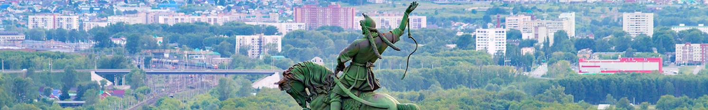

<html>
<head>
<link href="style.css" rel="stylesheet" type="text/css">
</head>
<body> <table width="100%" height="100%">

<tr height="20%">
<td colspan=3></td>
</tr>

<tr bgcolor="#D0D2FF" height="5%">
<td width="20%">
<a href="history.html">История</a>
</td>
<td>
<a href="dost.html">Достопримечательности</a>
</td>
<td width="20%">
<a href="rayons.html">Районы</a>
</td>
</tr>
<tr bgcolor="#FFF0F0">
<td>
Меню
</td>
<td colspan=2>
Новостной блок
</td>
</tr>
</table>
</body>
</html>
